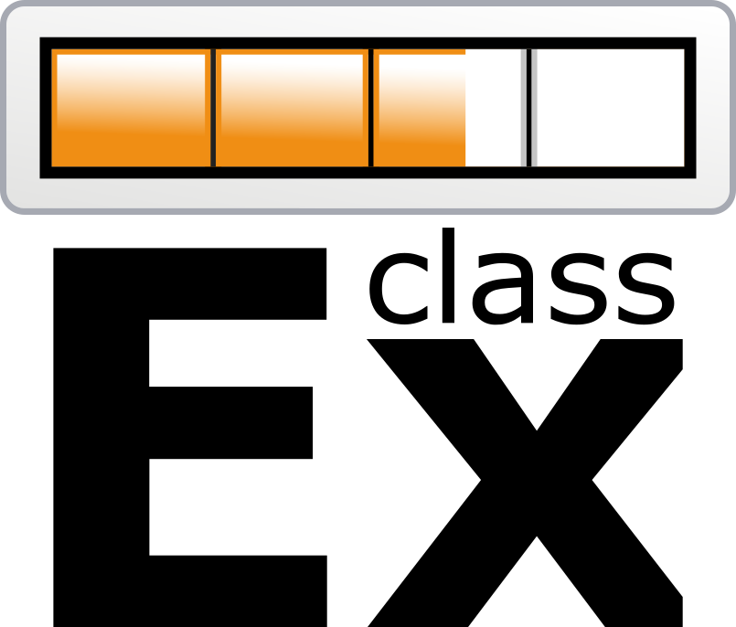

# Note to instructors

## Our purpose
Personal experience is a powerful teaching tool. *Experiments in Economics* is designed to provide teachers a complete set of materials to reduce the necessary effort while maximizing the reached advantages of class experiments. However, while running experiments in class is an innovative technique, it is already a very popularized practice. Next, we show some of the strategies you may have in mind to use this book. Then, we provide a brief mention to some of the external platforms you may explore for more information on class experiments.

## The content
First, *Experiments in Economics* is not just a manual with a list of ready protocols. We believe experiments should be related to the theory, questions and conclusions economics has to offer. Additionally, we understand experiments require time and careful logistic planning. Therefore, each experiment is related to the relevant units in *The Economy*. We recommend you see each unit in this book as a direct companion to the correspondent units in *The Economy*. On the other hand, each experiment comes with a group of materials. According to the case, a unit may contain some or all the next:
* _**A ready-to-use protocol:**_ with an outline of the instructions you should give to your students.
* _**Excel preconfigured formats:**_ with downloadable tables ready to register your data and perform automatic analysis.
* _**Predesigned printable tables:**_ with clear information your students need to participate in the activities, and physical formats to register actions.
* _**Video tutorials:**_ with introductory tours to external platforms.
* _**Informative diagrams:**_ with complementary information to communicate instructions to your students.

We present a base version of each experiment. Nevertheless, feel free to use the tools you consider more useful; and, modify any part of the design you prefer according to your pedagogical needs.

## How to use *Experiments in Economics*

There are at least three ways you can articulate to use the present materials. First, a course about a theoretical introduction to economics is a perfect environment to first expose students to the living decision making process through experiments. For example, you may select some units to use during a microeconomics, macroeconomics, or games theory course. In this case, we recommend you use this material simultaneously with *The Economy*. Briefly, you may create a dialog between theory and personal experiences.

Second, some of these experiments are suitable for an experimental methodology course. According to the concepts you want to illustrate, you may need to modify some of the contents. For example, to give your students an idea behind the treatments design, you may want to make small edits to the protocol behind a dictator game and assign them randomly to groups in your class. However, the general idea behind the classic experiment can still be understood through our materials.

On a third place, you may want to illustrate specific concepts that are not present explicitly in this book. You may select some of a unit’s content as a base model to modify materials, instead of working them out from scratch. For instance, you may take the templates for a double auction experiment and change the kind of shock the market experiences: a supply reduction, instead of a tax. Then, the book works as a complement to any related class project.

Finally, *Experiments in Economics* is not a book to be completely used at a single course, neither is it a sequential text. The materials presented in here are thought to be a guide or manual with multiple purposes. Feel free to use it as you better consider.

## An open window

As mentioned before, there is an extensive variety of other free resources you may consult as a reference to experimental economics. Next, we mention some of them. We strongly encourage you to explore them and find the tools that better fit your pedagogical interests.

### ClassEx

A widely used online tool developed by the University of Passau. Students may login from their smartphones. Games are designed to study many fields: from political science to economic strategic interaction.

### Marietta College

An outstanding compilation by Greg Delemeester and Jurgen Brauer of more than 170 well documented non-computerized experiments. The platform was developed by the Marietta College. You will find a clean reference with the associated concepts and procedure for each game.

### MobLab

An elegant graphical online tool. You will find an efficient mobile-first platform with microeconomics, games theory, macroeconomics experiments (among others). Students will see clear graphical interfaces in each game. Developed by founders from Caltech. Its services come subject to a price.

### VeconLab

Many experiments require a difficult logistic organization. Computer programs are a brilliant tool to implement experiments in class and outside the classroom as pedagogical tools. The University of Virginia provides a fully online implemented tool with more than 60 experiments to use in teaching or research.
