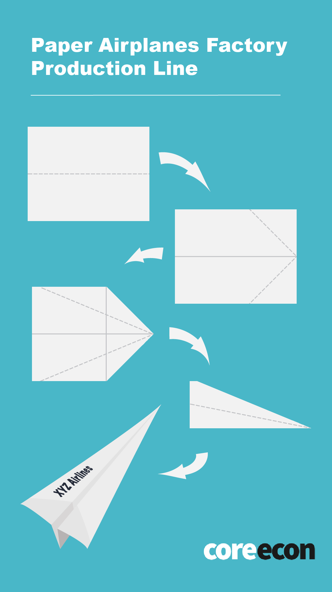

# **Experiment 1: Paper Airplanes Factory** Running the experiment

## Protocol

You should give your students the next instructions:
* Each of you is going to be a worker at a paper airplanes factory.
* Some firms will have 1 employee. Others will have more.
* Each of the firms will have a fixed space endowment on the table. It’s important that you use exclusively the assigned space.
* There will be groups of 1, 2, 3, 4, 5 and 10 students.
* All of you should produce this paper airplane with the mark XYZ Airlines on it.

Next, you should describe the instructions to build a simple paper airplane as shown in Figure 1.1.

_**Figure 1.1. Paper airplane folding instructions**_

Then, you may proceed:
* You can use as much recycled paper as you need. You will have 3 minutes to fold as many papers as possible. Remember you can only use one marker.
* Once the time is over, I will give the announce; and, you should stop folding to report how many airplanes did your firm build.

Next, you shall create groups with your students, depending on the number of people you have in total. Preferably, make groups of 1, 2, 3, 4, 5 and 10 individuals. If you have more students, repeat some of this groups in a balanced way.

Once the students are ready with the materials and assigned spaces, you should give the order and start a stopwatch. Give the “stop” order when the time is over. You may use the [suggested table](01-03.html) to register the results. Be careful that the students use the assigned materials and space.

## Class discussion

Once you finish the experiment, you may present a scatter plot with a predicted tendency similar to Figure 1.2.

_**Figure 1.2. Paper airplanes production function**_

You may present a linear tendency first and then a logarithmic one to discuss the difference between both cases: constant vs diminishing labor productivity. You may recognize the theoretical prediction in the plot. The slope of the tangent line to the production function should decrease as the number of workers increases. You may boost the discussion with some of these questions:

* Why do additional workers contribute less than the first worker to the total product?
* Could it be possible to keep a constant labor productivity out of this classroom (without moving anything else)? Would it be possible to double the production by doubling the number of workers? Why?
* What do you think would have happened if some firms had an additional table of space? Could they double their production by doubling the number of workers?

> [Materials and resources](01-03.html)
> {:.button}
{:.buttons}
 
